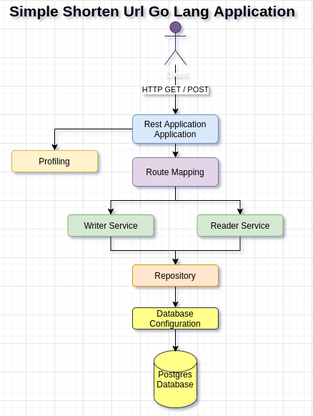

# REST API for Shorten URL with Go Lang
Application for shorten URL using UUID instead using [Go Lang](https://golang.org/)

## Running Application

__Configure environment__  
Requirements:  
1. [Go Lang](https://golang.org/)
2. [Docker](https://www.docker.com/)
3. [Docker Compose](https://docs.docker.com/compose/)  
Observations: You may configure docker to run without root, whereas you gonna need to use `sudo` before docker commands.

The environment consists in:  
1. [Postgres](https://www.postgresql.org/): Database
2. [PG Admin](https://www.pgadmin.org/): Manage Database

For configure the envirolmente run:
```bash
cd reader
docker-compose up
```

Access database throght the url http://localhost:16543/  
with credentials configured at [docker-compose.yml](https://github.com/skatesham/shorten-url-go-lang/blob/main/reader/docker-compose.yml), default look as following:
```
username: sham.vinicius@gmail.com
password: shan
```
Create an database called **"shorten"** and run in it the script [schema.sql](https://github.com/skatesham/shorten-url-go-lang/blob/main/reader/resources/data/schema.sql)  

You may need to check the IP Address that the postgres was built in:  
```
docker ps -> for see dockers running
docker inspect {id-container-docker-postgres} or {name-container-docker-posgres}
```
Find the key "IPAddress" and take its value, should look like this: "172.25.0.2"

Check if are correct in database credentials file [profile.go](https://github.com/skatesham/shorten-url-go-lang/blob/main/reader/config/profile.go)

**You are ready to GO !!!**

## Running Application
For running application you must run (inside reader folder):
```bash
go run application.go
```

## Acessing Application
__Create and shorten:__  
POST http://localhost:8080  
Payload:
```json
{"destination":"https://www.google.com"}
```
The return will be something like:
```json
{
    "id":1,
    "destination":"https://www.google.com",
    "shorten":"dcd95500-6213-4dfa-838f-de1979879476",
    "createdAt":"2020-10-30T21:16:25.010648Z"
}
```
It's possible use `Curl` application, as following:  
```bash
curl -X POST -d '{"destination":"https://www.google.com"}' localhost:8080
```


In this scenario the "created UUID" will be `dcd95500-6213-4dfa-838f-de1979879476`  

__Returning original url:__  

GET http://localhost:8080/{created UUID}  

Using `Curl`:
```bash
curl localhost:8080/9f125f78-fec2-4aed-9873-d43b78e1f0c4
```  

## Architecture Design  
<p align="center">
  
</p>  

> By Sham Vinicius Fiorin  
> Thanks

  


